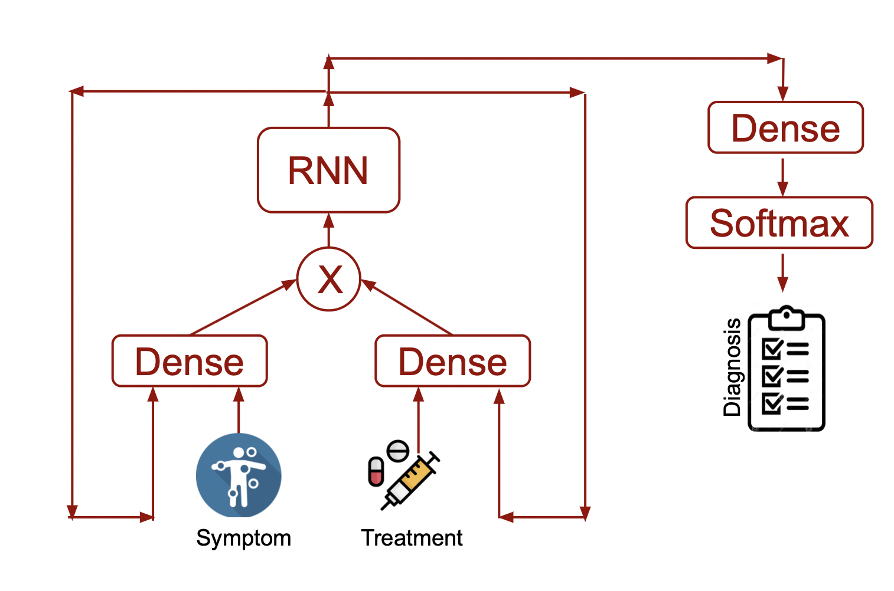
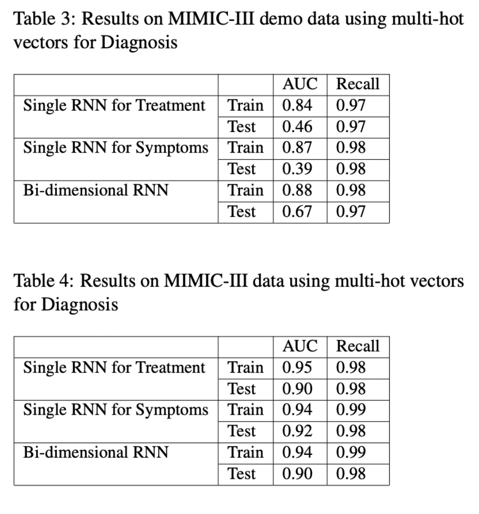

# DL4H-Project
Semester project for the course Deep Learning for Healthcare (CS598) of UIUC (Spring 2022).

# Original paper
## Citation
@inproceedings{bidim,

author = {Wang, Weijing and Guo, Chenkai and Xu, Jing and Liu, Ao},

year = {2019},

month = {07},

pages = {374-379},

title = {Bi-Dimensional Representation of Patients for Diagnosis Prediction},

doi = {10.1109/COMPSAC.2019.10235}

}
## Repository
Not available

# Dependencies
* python 3.6.9
* pytorch
* numpy
* pandas
* pickle
* gensim

# Data Availability

Follow the instructions at https://eicu-crd.mit.edu/gettingstarted/access/ to get access to the MIMIC-III Clinical Database.

# Model

# Result

# Implementation
Preprocessing: src/data_prep_1.py and src/data_prep_2.py
Architecture, training and evaluation: src/patient2vec.py and src/patient2vec-w2v.py
Ablation study: src/symptom2vec.py and src/treatment2vec.py
